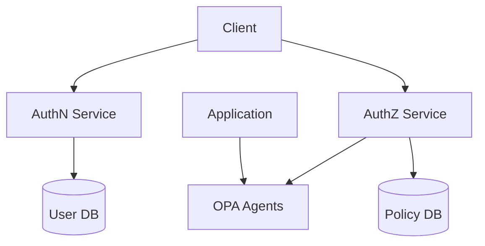

# 🏗️ Multi-Module Project Structure

## 📁 Root Layout
```
identity-platform/
├── go.work                  # Workspace definition
├── Makefile                # Root build tasks
├── docker-compose.yml      # Development setup
├── authn/                  # Authentication Module
│   ├── go.mod
│   ├── Dockerfile
│   ├── cmd/
│   │   └── api/           # AuthN service entry point
│   └── internal/
│       ├── user/          # User management
│       ├── organization/  # Organization management
│       ├── provider/     # Identity providers (Cognito, etc.)
│       ├── session/      # Session handling
│       └── api/          # HTTP handlers
│
├── authz/                  # Authorization Module
│   ├── go.mod
│   ├── Dockerfile
│   ├── cmd/
│   │   ├── api/          # AuthZ service entry point
│   │   └── syncer/       # Policy sync service
│   └── internal/
│       ├── application/  # Application management
│       ├── policy/       # Policy CRUD
│       │   ├── store/    # Policy storage
│       │   ├── template/ # Policy templates
│       │   └── validator/ # Policy validation
│       └── opa/          # OPA integration
│           ├── agent/    # Agent management
│           ├── bundle/   # Bundle generation
│           └── client/   # OPA client
│
└── shared/                 # Shared Libraries
    ├── go.mod
    └── pkg/
        ├── database/      # Database utilities
        ├── logging/       # Logging
        ├── telemetry/    # Monitoring
        └── crypto/       # Cryptography
```

## 🌐 Service Communication



## 📦 Module Dependencies

```go
// AuthN module go.mod
module github.com/your-org/identity-platform/authn

require (
    github.com/your-org/identity-platform/shared v0.0.0
)

// AuthZ module go.mod
module github.com/your-org/identity-platform/authz

require (
    github.com/your-org/identity-platform/shared v0.0.0
    github.com/open-policy-agent/opa v0.x.x
)
```

## 🔌 Inter-Service Communication

| From    | To      | Purpose                    | Method        |
|---------|---------|----------------------------|---------------|
| AuthZ   | AuthN   | User info for policies     | gRPC/HTTP     |
| App     | AuthZ   | Policy evaluation          | HTTP          |
| AuthZ   | OPA     | Policy distribution        | HTTP/Bundle   |

## 🛠️ Development Setup

```bash
# Start all services
make dev

# Start specific module
make dev-authn
make dev-authz

# Run tests
make test-all
make test-authn
make test-authz
```

## 🔐 Configuration Management

```yaml
# AuthN config
authn:
  port: 8001
  providers:
    cognito:
      userPoolId: xxx
      region: us-east-1

# AuthZ config
authz:
  port: 8002
  opa:
    bundle_dir: /etc/opa/bundles
    poll_interval: 30s
```
